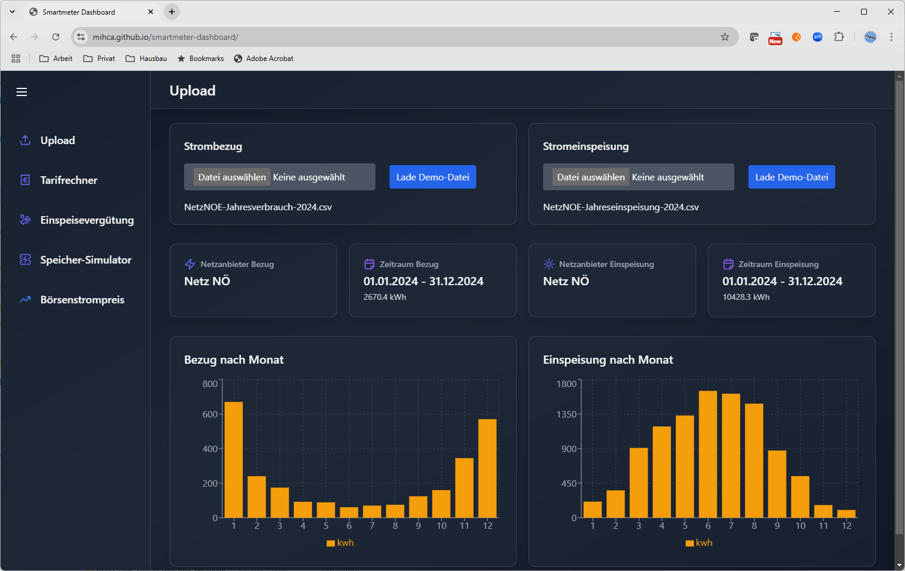
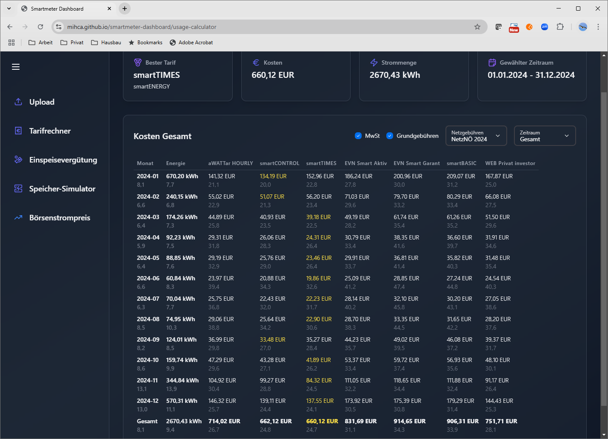
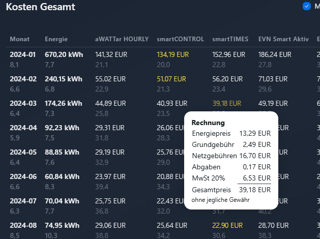
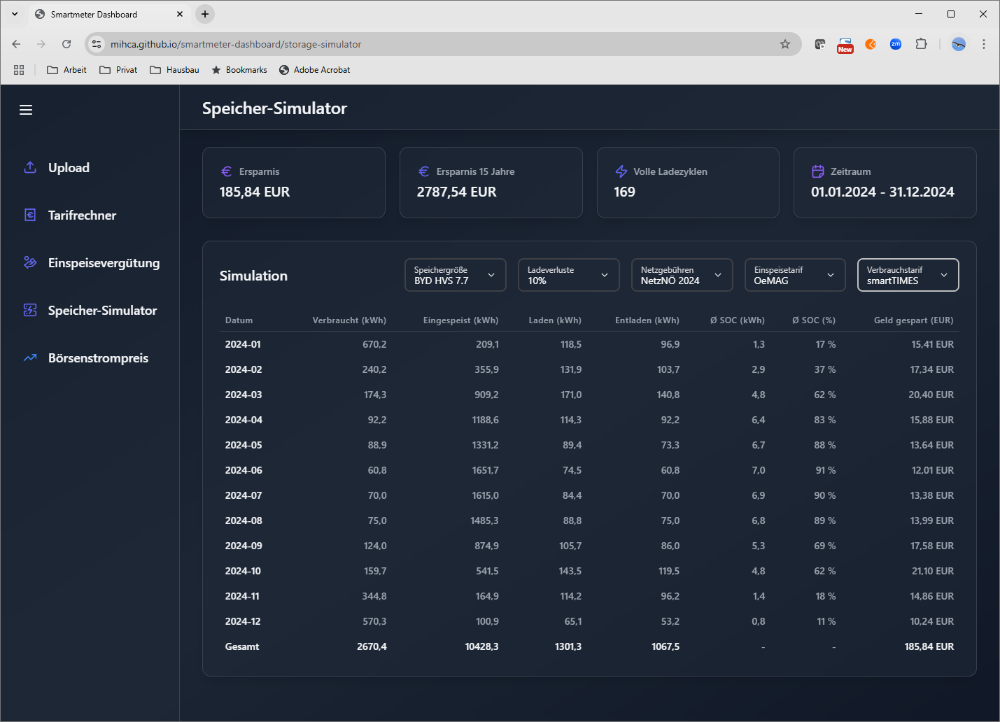

# [Smartmeter-Dashboard](https://mihca.github.io/smartmeter-dashboard/)
Ein Dashboard für die Auswertung von Stromverbrauch und Stromeinspeisung mit Börsenstrom
- Lohnt sich ein dynamischer Stromtarif für mich?
- Was würde ich bei einer dynamischen Einspeisevergütung erhalten?
- Lohnt sich ein Speicher für meine Solaranlage?

[Ausprobieren: "Lade Demo-Datei"](https://mihca.github.io/smartmeter-dashboard/)

Features:
- Import von CSV- und XLS-Dateien verschiedener Netzbetreiber



- Vergleich von dynamischen Stromtarifen anhand des historischen Börsenstrompreises



- Detaillierte Rechnung mit allen Gebühren beim Klick auf einen Monatsbetrag



- Simulation eines Stromspeichers



- Vergleich von dynamischen Einspeisetarifen
- Visualisierung des historischen Börsenstrompreises
- ...

Aktuell werden nur österreichische Formate und Tarife unterstützt.

**TODOs**:
- Layout für Tablet und Mobile mit Tailwind CSS
- Weitere Stromtarife
- Weitere Smartmeter-Dateiformate
- Weitere Netzgebühren
- Unterstützung Deutschland
- Erweiterung Auswertung Börsenstrompreise nach Jahren/Monaten/Uhrzeiten

# How to contribute
## Hinzufügen eines neuen Netzbetreiber-Formats
- Neuer Eintrag (Liste von Objekten) in
[providers-usage.js](https://github.com/mihca/smartmeter-dashboard/blob/main/src/data/providers-usage.js) (Verbrauchsdaten) oder
[providers-feedin.js](https://github.com/mihca/smartmeter-dashboard/blob/main/src/data/providers-feedin.js) (Einspeisedaten)
- Beispiel:
```
{
    name: "Netz NÖ",
    description: "Netz NÖ Verbrauch",
    match: (fileContent) => fileContent.includes("Messzeitpunkt;Gemessener Verbrauch (kWh)"),
    transform: (lineObject) => ({ 
        timestamp: parse (lineObject['Messzeitpunkt'], "dd.MM.yyyy HH:mm", new Date()),
        kwh: parseFloat(lineObject['Gemessener Verbrauch (kWh)'].replace(",", "."))
    }),
},
```
- Die `match`-Funktion liefert `true`, wenn im `fileContent` (String) die Zeichenkette gefunden wurde
- Die `transform`-Funktion parsed aus einem `lineObject` (csv von Papa.parse) die Inhalte für den Zeitpunkt (`timestamp`) und Strommenge (`kwh`)
- Test schreiben: [Beispiel](https://github.com/mihca/smartmeter-dashboard/blob/main/__test__/netznoe.test.js)
- Dateibeispiel in `/samples` ablegen
- Tests ausführen mit `npm run test`

## Hinzufügen eines neues Verbrauchs- oder Einspeisetarifs
- Neuer Eintrag (Map!) in [tariffs-feedin.js](https://github.com/mihca/smartmeter-dashboard/blob/main/src/data/tariffs-usage.js) (Bezugstarif) oder
[tariffs-usage.js](https://github.com/mihca/smartmeter-dashboard/blob/main/src/data/tariffs-feedin.js) (Einspeisetarif)
- Beispiel:
```
['smartENERGY.smartCONTROL', {
    name: 'smartCONTROL',
    description: 'Börsenstrompreis mit 1,2 ct netto Aufschlag',
    company: 'smartENERGY',
    link: 'https://www.smartenergy.at/fileadmin/user_upload/downloads/Kundeninformation_und_Preisblatt_-_smartCONTROL.pdf',
    base_fee_monthly_eur: 2.49,
    calculate: (year, month, weekday, hour, market_price_ct, kwh) => {
        return kwh * ( market_price_ct + 1.2 );
    }
}],
```
- Die `calculate`-Funktion berechnet auf Basis der Parameter den Energiepreis in ct
- `base_fee_monthly_eur` stellt die monatliche Grundgebühr in EUR ohne Mwst dar
- Alternativ ist auch die Angabe von `base_fee_yearly_eur` möglich, dann wird die Grundgebühr taggenau nach der Anzahl der Tage im Monat berechnet (z.B. macht das aWATTar so)

## Hinzufügen von neuen Netzgebühren
- Neuer Eintrag (Liste von Objekten) in
[netfees.js](https://github.com/mihca/smartmeter-dashboard/blob/main/src/data/netfees.js)
- Beispiel:
```
{
    name: 'NetzNÖ 2024',
    // Netznutzung Grundpreis pro Tag in ct: 9.863
    // Messpreis pro Tag in ct: 7.1671
    netfee_per_day_ct: 17.0301,
    // Netznutzung Arbeitspreis pro kWh in ct: 5.77
    // Netzverlustentgelt pro kWh in ct: 0.783
    netfee_per_kwh_ct: 6.553,
    // Elektrizitätsabgabe pro kWh in ct: 0.10
    tax_per_kwh_ct: 0.10
}
```
- `netfee_per_day_ct` umfasst die zeitabhängigen Gebühren pro Tag in ct ohne MwSt
- `netfee_per_kwh_ct` umfasst die verbrauchsabhängigen Gebühren pro kwh in ct ohne MwSt
- `tax_per_kwh_ct` umfasst zusätzliche Steuern und Abgaben in ct pro kwh ohne MwSt

# Wichtige Konzepte
## Zeitangaben
Alle Zeitstempel werden intern immer in **UTC** gespeichert, während die Netzbetreiber Dateien mit Lokalzeit liefern. Dies führt beim Wechsel von Sommer- auf Winterzeit dazu, dass eine Zeitangabe doppelt vorhanden ist. Dies wird beim Import aufgelöst.
## Alle Beträge in netto ohne MwSt
Alle Preise in Tarifen oder Gebühren werden immer in netto ohne MwSt erfasst.
## PDR 
Power Data Record: Speichert die kumulierten Verbrauchs- und Einspeisedaten auf Stundenebene.

ACHTUNG: Die Zeitangabe bezieht sich auf das Ende der Stunde.
```
let pdr = {
    provider: "Netz NÖ",
	utcHourFrom: 1704067200000,
	utcHourTo: 1735686000000,
	fileName: "NetzNOE-Jahresverbrauch-2024.csv",
	hourData: [
        {utcHour: 1704067200000, kwh: 0.217},
        {utcHour: 1704070800000, kwh: 0.187},
        ...
    ]
}
```
## MDR 
Market Data Record: Speichert die Preise der Strombörse für jede Stunde in UTC. 

ACHTUNG: Die Zeitangabe bezieht sich auf den Anfang der Stunde.
```
let mdr = {
	country: "at",
	utcHourFrom: 1704063600000,
	utcHourTo: 1735686000000,
	hourMap: [
        { key: 1704063600000, value: 0.01 },
        { key: 1704070800000, value: 0.001 }
    ]
}
```
# Lokale Entwicklung
```
npm install
npm run dev
```
Developed with npm 10.9.0 und node v22.11.0. Maybe its a good idea to use 
[nvm](https://github.com/coreybutler/nvm-windows).

## React + Vite
Das Projekt basiert auf React, Javascript, Vite und dem react-admin-dashboard von Burak:
- [react-admin-dashboard](https://github.com/burakorkmez/react-admin-dashboard) on github
- [Tutorial Video](https://youtu.be/gK0v_d91epk) on Youtube

## 3rd Party
### Tailwind CSS
A utility-first CSS framework
- [Homepage](https://tailwindcss.com/)
- [CheatSheet](https://nerdcave.com/tailwind-cheat-sheet)
- [Responsive Design](https://tailwindcss.com/docs/responsive-design)

### Next UI
Component library with good integration in tailwind CSS
- [Homepage](https://nextui.org/)
- [Components](https://nextui.org/docs/components)

### Lucide
For icons
- [Icon reference](https://lucide.dev/icons/)

### Motion
A modern animation library for JavaScript and React (nice to have)
- [Homepage](https://motion.dev/)

### Papaparse
The powerful, in-browser React CSV parser for big boys and girls
- [Homepage](https://react-papaparse.js.org/)